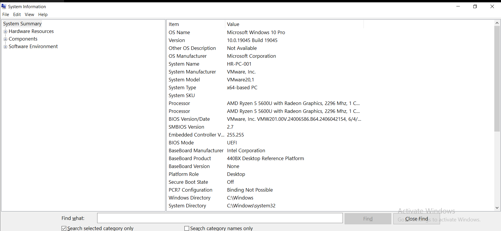
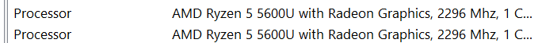
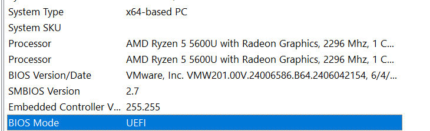
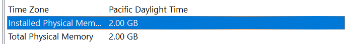

# IT Support Ticket 012 – System Information (msinfo32) Hardware Inspection

## 📌 Project Overview

In this lab, I explored the Windows **System Information (msinfo32)** utility to inspect a computer's hardware and operating system information.

System Information is one of the first tools an IT Support Technician uses to verify system specifications before troubleshooting hardware issues, recommending upgrades, or diagnosing compatibility problems.

For this demonstration, I used a Windows 10 virtual machine running on VMware to simulate a real-world IT Support environment.

---

## 🎯 Objective

The objective of this lab was to learn how to:

- Open System Information (msinfo32)
- Identify the operating system installed
- Inspect processor information
- Verify installed physical memory (RAM)
- Check the BIOS Version and BIOS Mode
- Identify the System Type (64-bit architecture)
- Understand how IT Support technicians use this information during troubleshooting

---

## 💼 Scenario

A customer contacts the IT Help Desk requesting advice on upgrading their computer but is unsure of the system specifications.

Before recommending any hardware upgrade, the first step is to inspect the computer's current configuration using **System Information (msinfo32)**.

Gathering accurate system information allows IT Support professionals to make informed decisions instead of relying on assumptions.

---

## 🛠️ Tools Used

- Windows 10 Pro
- System Information (msinfo32)
- VMware Workstation
- GitHub
- YouTube

---

## 🧠 Skills Demonstrated

- Windows Administration
- Hardware Identification
- System Diagnostics
- Hardware Documentation
- Technical Communication
- Troubleshooting Methodology

---

# Lab Procedure

### Step 1

Press **Windows + R** to open the Run dialog box.

Type:

```
msinfo32
```

Press **Enter**.

---

### Step 2

Review the **System Summary** page.

Identify:

- Operating System
- System Manufacturer
- System Model
- System Type
- Processor
- BIOS Version
- BIOS Mode
- Installed Physical Memory (RAM)

---

### Step 3

Record the important hardware information before beginning any troubleshooting or upgrade recommendations.

This approach ensures decisions are based on verified system specifications rather than assumptions.

---

# Screenshots

## System Information Overview



Displays the Windows System Summary, including operating system details, system manufacturer, processor, BIOS information, and overall system configuration.

---

## Processor Information



Displays the processor installed in the virtual machine.

Processor identified:

**AMD Ryzen 5 5600U with Radeon Graphics**

---

## BIOS Mode and System Type



Confirms:

- BIOS Mode: **UEFI**
- System Type: **x64-based PC**

These details are important when verifying operating system compatibility and hardware architecture.

---

## Installed Physical Memory



Displays the amount of RAM allocated to the virtual machine.

Installed Physical Memory:

**2 GB**

This virtual machine is configured with 2 GB of RAM for demonstration purposes.

---

# 🧩 Troubleshooting Mindset

One of the most important habits in IT Support is **collecting information before making decisions**.

Rather than immediately recommending a hardware upgrade or replacing components, an IT technician should first verify the computer's specifications using built-in Windows tools such as **System Information (msinfo32)**.

This evidence-based approach reduces unnecessary troubleshooting and leads to more accurate technical decisions.

---

# ✅ Key Takeaways

- Learned how to open System Information using **msinfo32**
- Identified key hardware specifications
- Verified BIOS Version and BIOS Mode
- Confirmed the system architecture (64-bit)
- Inspected installed physical memory
- Understood how IT Support technicians gather system information before troubleshooting
- Reinforced the importance of making decisions based on evidence rather than assumptions

---

# 💭 Professional Reflection

This lab reinforced the importance of gathering system information before troubleshooting or recommending hardware upgrades.

Instead of making assumptions about a computer's capabilities, IT Support professionals should first verify the operating system, processor, memory, BIOS information, and system architecture.

Developing this habit improves troubleshooting accuracy, reduces unnecessary hardware replacements, and supports better technical decision-making.

---

# 🎥 Video Demonstration

YouTube Walkthrough:

https://youtu.be/MmDyxE7-kG8

---

## 👩🏽‍💻 Author

**Dumebi Obuh**

Aspiring IT Support Specialist | Cybersecurity Professional

GitHub:

https://github.com/dumebiobuh0
